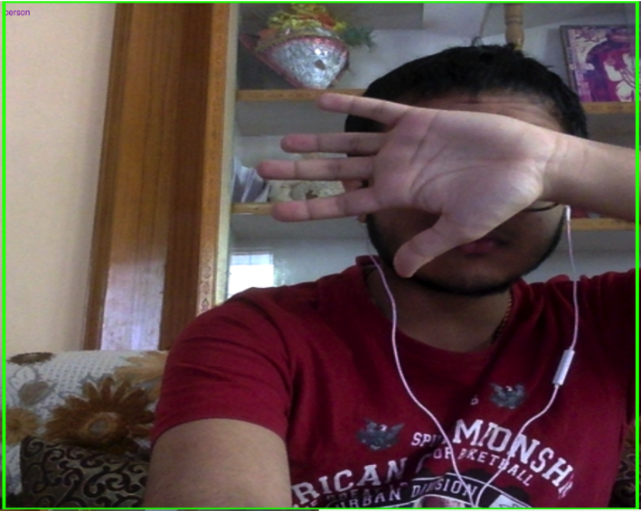

# Basic-ML-App

A simple script that uses ML5 for detecting body movements and different body parts.
Source : https://learn.ml5js.org/docs/#/

To include detection function => use pose.js
Similarly, to include the detection script => use yolo.js 

       
Detecting me as a person even after I hide my face
   

